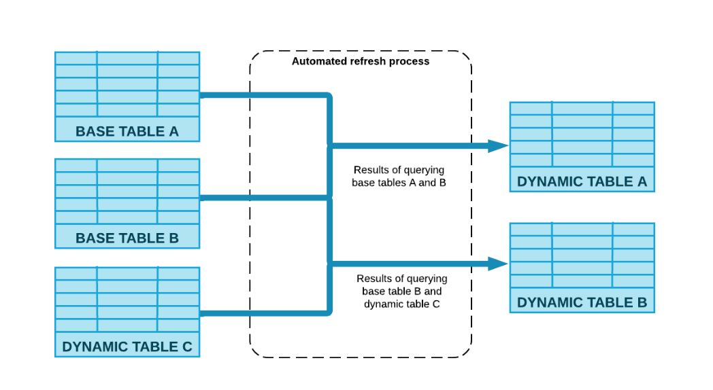
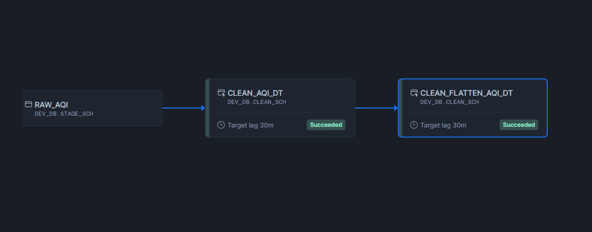
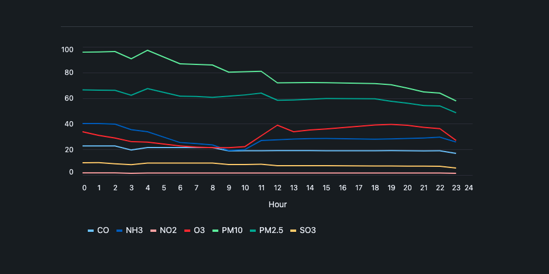

# End to End Data Engineering with Snowflake API (AQI) Data
*Data Source:* <a href='https://data.gov.in'>data.gov.in</a>

*You may encounter registration issues outside of India but you can use the zipped data to load manually or use a different api and apply the concepts. The U.S. api's available did not produce what is needed for this project, at least not one I could easily find.*

## Overview:
This project takes weather air quality data from an API and ingests the JSON files into a Snowflake internal stage. Using an automated task (45 mins for api calls), the data will load from stage to a clean layer using dynamic tables. Once cleaned, we can transform and created a dimensional model (min-star schema) using dyanmic tables to automaticalkky udate as downstream tables. 

Snowflake Engineering concepts applied are:
- Snowpark API calls
- Internal stage loads
- Variant data type and extracts for JSON data
- Automated Tasks
- Dynamic Tables that refresh on a downstream lag
- Dimensional modeling in SNF
- Data Visualization with Streamlit

*It's important to note that this is only a simple example, not a tutorial but more of my own project learning. Feel Free to try it!*

Source: follow for lots of cool snowflake engineering techniques - <a href='https://www.youtube.com/c/DataEngineeringSimplified' target="_blank">data engineering simplified</a>


### Requirements:
- Ingest API data.
- Add audit columns to stage layer.
- Transform JSON data to VARIANT.
- Extract select dimension for location and select measures to create avergare AQI for 7 pollutants.
- Create a consumable dimensianl model.
- Create one large table model.
- Create aggregated fact table.
- Create visualization with streamlit
- Integrate API Data source with snowflake using snowpark.


### Steps

1. Extract data from api using snowpark and load to internal stage.
2. Add audit columns to stage table for files using metadata$psuedocolumns
3. Extract columns from nested json object to create a clean layer. Use dynamic tables.
4. Transform metrics from column attributes to columns and create consumption layer. Usijng dynamic tables.
5. Model data dimensionally creating dim and fact tables. These are also dynamic tables in the consumption layer.
6. Create aggregated fact table using dynamic tables.
7. Create visuals using streamlit.

### Capacity and Cost Planning: (Our first order of business...., typically)
Some common things to add before we start are an understanding to our scalibility. This is always a must in DE planning and usually comes after the conceptal step (though we have skiped that part here for the sake of simplicity).

- What will happen if we add more data? (It's vital to understand this)
    - Max variant column size is 16MB compressed per row in Snowflake. No problems here.

    - File size for the seven metrics per 24 hour for all stations is around 90kb an hour * 24 hrs = 2,160 kb or 2.16mb.
    - When we convert to a monthly figure this is approximately 65kb or 0.065gb per month or less than 1gb per year whihc of course is compressed data.

    - This is not a lot of data BUT there are several key points here:
        - Each hour represents a variant row and is well within the limts of 16MB compressed.
        - We are transforaming this data and it will be on several layers at one time but does it persist or is it temporary? That depends on how you design your pipeline stages. Most likley it does not persist as we are storing the originak files.

        - Our max intake per day is generally around 2mb for all stations. Cloud storage can handle this without problems. Snowflake overall can handle this easily in either compute or storage (using internal stage or external).

    - They key here would be to understand the long term data approach. If data is collected for long term > 12-24 months, a long term capacity plan would need to be implemented such as an archive cold storage solution after N months or years to minimize costs. Historical trends are typiclaly analyzed in OLAP solutions and therefore we could certainly plan for 24 months minimum. 

    Other considerations:

    **Cost-** If we this process runs once an hour at $3 a credit, we need to figure out our per minute cost for compute. Stakeholders like this appraoch generally. 
    - Let's assume a x-small WH at 1 credit an hour which = $3.
    - If we run our API (this is general and assuing regualr SNF compute) for 1 minute every hour (this assumes the entire process takes 1 minute which may or may not be true for everyones process), we have 60 minutes /1 =  $0.05 per minute cost. 
    - Next we apply this to our total run time whcih is 24 runs * 1 = 24 * 0.05 = $1.20 a day for compute cost or $36.00 monthly. This is likley more and only a simple example of what we may apply to get the approximate costs for our pipeline. There are other factors to consider and often we run with it and then optimize but this generally helps in the begining if we take a little time to apply it. Keep in mind, this was only factoring in the API, the other compute costs would be more as Snowflake bills at 1 minute minimums and our layered architecture will take sevral minutes as each process will almost certainly be billed for at least one minute so there would be a different multiplier involved here, You need to undertsand how many minutes each pipeline task/dynamic table is running for and total that to find your per minute cost.

**Notable:** *we will reduce the above even further as the seven metrics will al be part of one  row after transforming the metrics from column attributes to columns which will reduce the size by a factor of six.*


### The Layered Architecture Process Flow 


1. The stage layer ingest the data to an internal stage.

2. Once ingested, audit columns are added from the **metadata$filename** as _stg_file_name,      **metadata$FILE_LAST_MODIFIED** as       _stg_file_load_ts, **metadata$FILE_CONTENT_KEY** as _stg_file_md5, and the **current_timestamp()** as _copy_data_ts is used for a load time capture. 

- Also added fpr audit purposes are the version and count of records for that time period.

- The JSON data is captured in a VARIANT column whihc is extracted later in the clean process.

- This layer is to really add our audit columns and put the JSON data in a VARIANT column. 

A task is created here to automate the ingestion. Below is what the table lookks like at the stage layer with audit columns added and the JSON data stored as VARIANT (in column $1).


## Stage & Clean Layer with All Attributes Before final Transpose
<br/>


Once staged, it is time to clean the data and use dynamic tables for our transformations.

In this layer, we first **flatten** and **de-duplicate** the data (additional files are laoded that are dups for example) using a window function to capture all duplicate values.

- Snowflakes **flatten** function is used to create a tabular representation of the **VARIANT** data for a select number of records associated with the above requirements.

## Using Dynamic Tables (capturing clean layer to consumption)

What are dynamic tables?

Here’s why they’re beneficial:

- Declarative programming: Define your pipeline outcomes using declarative SQL without worrying about the steps to achieve them, reducing complexity.

- Transparent orchestration: Easily create pipelines of various shapes, from linear chains to directed graphs, by chaining dynamic tables together. Snowflake manages the orchestration and scheduling of pipeline refresh based on your data freshness target.

- Performance boost with incremental processing: For favorable workloads that are suited for incremental processing, dynamic tables can provide a significant performance improvement over full refreshes.

- Easy switching: Transition seamlessly from batch to streaming with a single ALTER DYNAMIC TABLE command. You control how often data is refreshed in your pipeline, which helps balance cost and data freshness.

- Operationalization: Dynamic tables are fully observable and manageable through Snowsight, and also offer programmatic access to build your own observability apps.

- Dynamic tables simplify data engineering in Snowflake by providing a reliable, cost-effective, and automated way to transform data. Instead of managing transformation steps with tasks and scheduling, you define the end state using dynamic tables and let Snowflake handle the pipeline management.

A dynamic table reflects query results, eliminating the need for a separate target table and custom code for data transformation. An automated process updates the results regularly through scheduled refreshes. Since a dynamic table’s content is based on the query, you can’t modify it using DML operations. The automated refresh process materializes query results into the dynamic table.



Dynamic tables are best used when:

- You don’t want to write code to track data dependencies and manage data refresh.

- You don’t need, or want to avoid, the complexity of streams and tasks.

- You do need to materialize the results of a query of multiple base tables.

- You need to build multiple tables to transform data via an ETL pipeline.

- You don’t need fine-grained refresh schedule control and you just want to specify the target data freshness for your pipelines.

- You don’t need to use unsupported dynamic query constructs such as stored procedures, non-deterministic functions not listed in Supported non-deterministic functions in full refresh, or external functions, or need to use sources for dynamic tables that are external tables, streams, or materialized views.

*Source: Snowflake Docs*

## Stage to clean layer DAG

Using dynamic tables with a 30 minute lag will allow us an automatic downstream update once new data loads into the dynamic table. This automates the clean process.



## Modeling the Data

### [Wide Table Approach]('1-sql-scripts\05-wide-table-consumption.sql)

Why the wide fact table approach?

All the data is joined into one wide denormalized table. As a result, this approach is commonly called the “One Big Table”. This design takes advantage of the benefits of columnar databases like Snowflake and Google Big Query and makes it easier to query since all tables have been pre-joined. 

This examle is only a demonstration of the appraoch as modeled from a star schema. You dont actually need the star schema to create it.

- The target lag is 30 minutes fo each dynamic table in the DAG. Refresh occurs every 30 minutes and travels downstream in the DAG.


### Dimensional Model (Consumption Layer)

This layer is designed for our downstream users to be able to join and create reporting as needed. The start schema model make it easy, transparent and inutitive for our data concumers.
The layerd architecture we use along the way allows ot easily makes changes to the underlying buiness logic wothout breaking things that impact our downstream users.
This is an extremely simple model but built to showcase the end result of an api-json transformation into buisiness intelligence. 
- creates one fact and two dimension tables.

- the fact captures the measurments and the dims capture the context (aka location, etc).


### Fact DAG
- The dag below shows the dependencies of the dyamic tables with a 30 minute lag.

- The fact and dims update from the clean and flatten table which updates from the clean whohc updates from the stage.


### Refresh Dynamic Tables with New Data: mimick the an automated process (or use it as with cron).

-- add day 2-5 files (approximately 90 files) manullay to internal stage and then:

- Run task manuualy or on cron shcedule and tables will update as data is added to the stage layer via API.

- Or tables can also be updated manually with a click of the button below.

- Either way will illustrate how the task and dynamic tables work in the DAG. Each node needs refreshed (dims/facts)


## Creating the Aggregated Fact for User Consumption

Why do we need to create an aggregated fact table?

- Nearly 80-90% of the time your true fact will have line items for every order but this situtation is different as it is not a product or a customer order (which comes in so many varieties with line items....). In this case, we aggregate by the order as to summarize it and if you want true transactional data, you refer to this fact rther than the aggregate summary.

- The details are pre-computed in a summary making it quick to get summary results without the need of joining tables or doing calculations that may differ from one another and adhere to business rules/logic which provides conistency across the organization.

- We can also aggregate on varous levels to make common BI easily accessible and transaprent to many groups.

- Most notably, pre-aggregated data saves us a lot on compute costs!

This is created by using an average across the pollutants where we group by time, country, state, city and store the data in a dynamic table so it auto updates as a downstream table with a 30 minute lag. The data is aggregated at the city level with the granularity at the hour level.

Example DAG for the entire process flow:


To see the results before the dynamic table created with city aggregation and time granularity we can use:

```sql
select 
    * 
from agg_city_fact_hour_level 
where 
    city = 'Bengaluru' and 
    MEASUREMENT_TIME ='2024-03-04 11:00:00.000'
order by 
    country, state, city, measurement_time
limit 100;
```
Filtering by one city will now produce one row:


Several other pre-aggregated facts are slow created to show:
- Day level with AQI averages (the above is hourly, same aggregtion but granularity changes to day).

Example DAG where DAG goes from 28.7k (hourly by city) results to 1.3k (daily by city) results with pre-aggregation.


## Streamlit Data Visualization

Streamlit allows us to create visuals right inside of Snowflake. It connects via api and we can write code to produce a visualization of our data. Below are a few examples.

Streamlit Stacked Bar - Search paramters

- By adding some simple lines of code we can add select boxes for various parameters to search our data. Below shows a stacked bar with all pollutants that are hoverable to show values of the pollutant over a select date and city.




Trendline with Search Paramters (similar to above with select options):


Map Example:


## Automation with GitHub Actions

Github Actiona allow us to automate the workflow with one simple yml file that we add to our repository.

```yml
# This is a basic workflow to help you get started with Actions
name: india_air_quality_json

# Controls when the workflow will run
#on:
  # Triggers the workflow on push or pull request events but only for the main branch
#   workflow_dispatch:
on:
  schedule:
     - cron: '45 * * * *'  # Runs every 45th min

# A workflow run is made up of one or more jobs that can run sequentially or in parallel
jobs:
  # This workflow contains a single job called "build"
  build:
    # The type of runner that the job will run on
    runs-on: ubuntu-latest

    steps:
      - uses: actions/checkout@v3
      - run: |
          home_dir=$(pwd)
          echo $home_dir
          echo -----------------------------------------------------------------------
          pip install --upgrade pip    
          echo -----------------------------------------------------------------------
          pip install "snowflake-snowpark-python[pandas]"
          echo -----------------------------------------------------------------------
          ls -la
          pwd
          echo ----------------------------------------------------------------------- 
          python $home_dir/ingest-api-data.py
```

## Recap

This example pulls data on an hourly schedule using Snowpark's API call feature with Python. The data is then transformed using a layered architecture above while also demonsrtrating the one big table approach. 